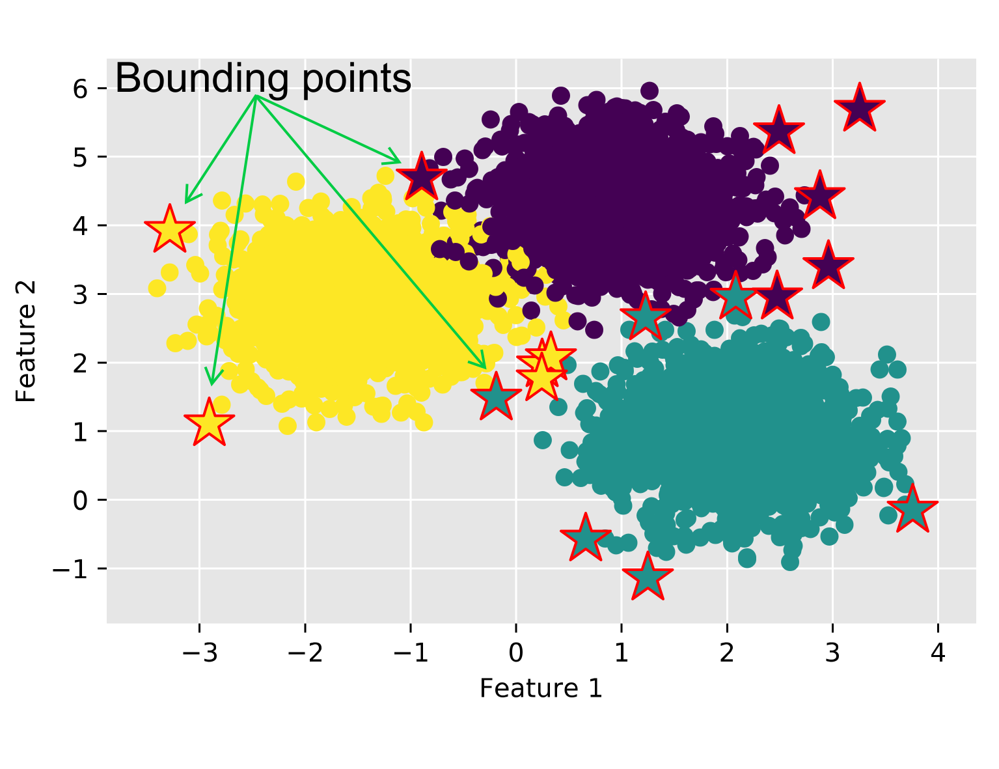

# Cluster Analysis with Multidimensional Prototypes (CLAMP)
## About
CLAMP main goal is to explain differences between clustering, by using state-of-the-art XAI methods and rule-based representation of explanations.
It generates bounding boxes that define boundaries of clusters to be explain and exploit it to generate better explanations of the clusters.



CLAMP can use following rule-based explainers (included in the code):
  * [LUX](https://github.com/sbobek/lux) -- Bringhs uncertinaty to the explainable model by building local uncertain decision tree based on informaiton from model predictions.
  * [Anchor](https://github.com/marcotcr/anchor) -- An anchor explanation is a rule that sufficiently “anchors” the prediction locally – such that changes to the rest of the feature values of the instance do not matter. 

## Instalation
First of all clonde the repository and its submodules, and enter it:

```
git clone https://github.com/sbobek/clamp.git
cd clamp
git submodule update --init --recursive
```
Some of the packages used in CLAMP are not available in conda, hence the following code should set up all of the requirements in virtual environment:

```
conda create --name clampenv python=3.8
conda activate clampenv
conda install pip
pip install -r requirements.txt
```

Additionally if you want to wotk with [JupyterLab](https://jupyter.org/) install it and raun it, while being in active `clampenv` envoronment by:

```
pip install jupyter lab
jupyter lab
```

Open `usage_example.ipynb` in your JupyterLab and see how CLAMP works in practice.

## Usage example
## Cite this work
TBA
